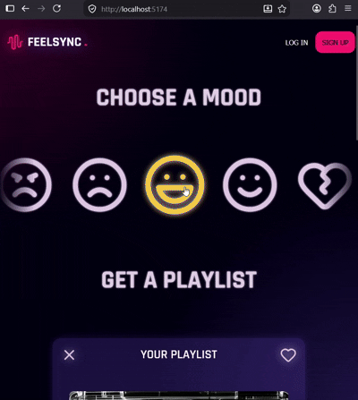

# feelSync

FeelSync is a web application that generates personalized recommendations based on a user's mood. Users enter how they're feeling, and the app creates a curated experience including music playlists, activities, and book recommendations.

🚧 This project is currently under development. Playlist history and liked playlists are actively being implemented.

## Features in progress
- Mood-based recommendations
- Playlist suggestions
- Activity recommendations
- Book recommendations
- Responsive interface

## Tech Stack
### Frontend
- React
- TypeScript
- CSS
- Lucide React
### Backend
- Express.js
### Planned Integrations
- Gemini API

## Project Goals

The goal of this project is to explore how AI-powered recommendations can create a personalized entertainment experience based on a user's emotional state.

## What I'm Learning
- Full-stack application development
- REST API design with Express
- State management in React
- TypeScript best practices
- Data persistence and user preferences
- AI integration workflows

## Planned Improvements
- Gemini-powered recommendation generation
- User authentication
- Custom playlist creation
- Recommendation history
-Favorites system
- Enhanced recommendation accuracy
